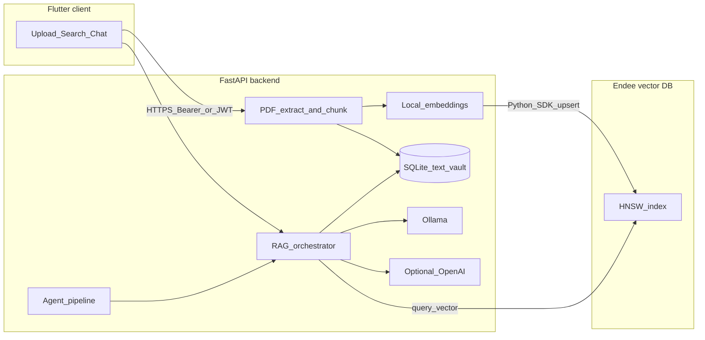

# Private HR Assistant (Endee + RAG)

A privacy-oriented demo for HR teams: **semantic search and RAG over sensitive PDFs** (resumes, performance reviews) using a **Flutter** client, a **Python (FastAPI)** backend, and **[Endee](https://docs.endee.io/)** as the vector database. Retrieval is augmented with a **local LLM (Ollama)** by default, with an optional **cloud LLM** for convenience.

---

## Project overview

HR workflows depend on **highly sensitive text** that should not be treated like ordinary documents in a typical vector stack. Many RAG demos send **plaintext or raw embeddings** to a database that can read and index them as usual—which means a **database or backup breach** can expose employee content or reversible embedding payloads.

This project demonstrates a **privacy-first split**:

- **Endee** stores **encrypted / queryable-encrypted vectors** and serves **similarity search** without needing plaintext vectors on the server in the same way a traditional vector DB does.
- **Chunk text** (the actual resume or review wording) stays in a **separate application database (SQLite)** on the API host, under your access controls—not in the vector store as searchable plaintext.

Together with **local embeddings** and an optional **local LLM**, you can tell a credible story: *privacy is part of the design, not an afterthought.*

---

## Problem statement

| Challenge | What this project does |
|-----------|-------------------------|
| Sensitive PDFs must support **semantic search** and **Q&A** | Chunk PDFs, embed with a **local** sentence-transformer model, index vectors in **Endee**, answer with **RAG**. |
| A **vector DB breach** should not trivially leak employee content | **No full chunk text** is stored in Endee—only vectors plus **opaque IDs and filter codes**; text lives in **SQLite** on the backend. |
| Mobile/client must not hold secrets | **Flutter** talks only to **FastAPI**; **no Endee keys** or model keys ship in the app. |
| Some teams want **no third-party LLM** | Default generation uses **Ollama** on your machine; **OpenAI** is opt-in via env. |

---

## System design and technical approach

### Architecture



### Data flow (ingestion)

1. User uploads a **PDF** through the Flutter app to the backend.
2. Text is extracted and **chunked** (with page hints for citations).
3. Each chunk is embedded with **sentence-transformers** (local; no external embedding API in the default path).
4. **SQLite** stores chunk **text** and document metadata.
5. **Endee** receives **one vector per chunk**, with `meta`/`filter` fields for **document id, page, department code, doc type**—not the raw paragraph text.

### Data flow (query / RAG)

1. User question → **same embedding model** → **Endee `query`** → top‑k chunk **IDs**.
2. Backend loads **text** for those IDs from **SQLite** and builds a **cited context** block.
3. **Ollama** (default) or **OpenAI** (if enabled) generates an answer **grounded in those excerpts**.

### Other features

- **Recommendations:** nearest-neighbor search over the same index (optional **dept** / **doc_type** filters).
- **Agentic workflow:** a small server-side pipeline—**semantic search → list sources → summarize with citations**—exposed as `/agent/run` and tool routes.

---

## How Endee is used

[Endee](https://docs.endee.io/) is a **high-performance vector database** with a **client-side security model**: vectors (and queries) are handled so the **server does not rely on storing plaintext vectors** like a conventional vector store. Practically, you use the **official Python SDK** (`pip install endee`) to:

1. **Create an index** (e.g. cosine similarity, dimension matching your embedding model—here **384** for `all-MiniLM-L6-v2`).
2. **Upsert** one record per chunk: `id`, **dense vector**, **metadata** (chunk/document IDs, page), and **filters** (e.g. `dept_code`, `doc_type` as opaque codes).
3. **Query** with an embedding of the user question and optional **metadata filters** for scoped search.

**What to say in an interview (precise wording):**

- Endee backs **semantic retrieval** with **encrypted / queryable-encrypted vectors**, so a **breach of the vector service** does not deliver the same risk profile as dumping **plaintext embeddings and text** from a classic DB.
- **Honest caveat:** chunk **text** is still stored in **SQLite** for RAG; protect that host, use TLS in production, and treat **cloud LLM** mode as a separate trust boundary (snippets leave your network).

---

## Setup and execution

### Prerequisites

- **Docker** (for Endee; optional Ollama)
- **Python 3.12+**
- **Flutter SDK** (for the client)

### 1. Start Endee

From the repository root:

```bash
docker compose up -d endee
```

The server listens on **`http://127.0.0.1:8080`** (API base `http://127.0.0.1:8080/api/v1`). Optional auth: set `NDD_AUTH_TOKEN` in `.env` and the same value as `ENDEE_AUTH_TOKEN` for the backend.

### 2. Optional: local LLM (Ollama)

```bash
docker compose --profile llm up -d ollama
docker exec -it ollama-server ollama pull llama3.2
```

Configure the backend with `OLLAMA_BASE_URL` and `OLLAMA_MODEL` (see `.env.example`).

### 3. Backend (FastAPI)

```bash
cd backend
python -m venv .venv
```

**Windows (PowerShell):**

```powershell
.\.venv\Scripts\Activate.ps1
pip install -r requirements.txt
Copy-Item ..\.env.example .env
# Edit .env: ENDEE_BASE_URL, API_BEARER_TOKEN, Ollama, etc.
uvicorn app.main:app --reload --host 0.0.0.0 --port 8000
```

**macOS / Linux:**

```bash
source .venv/bin/activate
pip install -r requirements.txt
cp ../.env.example .env
uvicorn app.main:app --reload --host 0.0.0.0 --port 8000
```

**Smoke-test Endee** (with Endee running):

```powershell
# Windows
set ENDEE_BASE_URL=http://127.0.0.1:8080/api/v1
python scripts\verify_endee.py
```

```bash
# macOS / Linux
export ENDEE_BASE_URL=http://127.0.0.1:8080/api/v1
python scripts/verify_endee.py
```

**Health check:** `GET http://127.0.0.1:8000/health`

### 4. Flutter client

The app only calls your API; set the base URL per environment:

| Environment | Example API base URL |
|-------------|----------------------|
| Desktop / same machine | `http://127.0.0.1:8000` |
| Android emulator | `http://10.0.2.2:8000` |

```bash
cd frontend/hr_assistant
flutter pub get
flutter run --dart-define=API_BASE=http://127.0.0.1:8000
```

In the app: use **Login (JWT)** or disable JWT and paste the **same token** as `API_BEARER_TOKEN` from `.env`.

### 5. Optional: full stack in Docker

```bash
docker compose --profile full up -d --build
```

Add `--profile llm` if you want the Ollama container. Align `OLLAMA_BASE_URL` with your deployment (host vs container name).

---

## Configuration (summary)

Copy `.env.example` to `backend/.env` and adjust:

| Variable | Purpose |
|----------|---------|
| `ENDEE_BASE_URL` | Endee API base (default `http://127.0.0.1:8080/api/v1`) |
| `ENDEE_AUTH_TOKEN` | Matches Docker `NDD_AUTH_TOKEN` if set |
| `API_BEARER_TOKEN` | Static bearer for demos; Flutter can use without JWT |
| `DATABASE_PATH` | SQLite path for chunk text |
| `OLLAMA_BASE_URL` / `OLLAMA_MODEL` | Local RAG generation |
| `USE_CLOUD_LLM` / `OPENAI_API_KEY` | Set `1` + key to use OpenAI instead of Ollama |

---

## API overview

| Method | Path | Description |
|--------|------|-------------|
| `POST` | `/auth/login` | Issue JWT for the Flutter client |
| `GET` | `/health` | API + Endee connectivity |
| `POST` | `/documents/upload` | Ingest PDF → SQLite + Endee vectors |
| `GET` | `/documents` | List uploaded documents |
| `POST` | `/search` | Semantic search; optional `dept_code`, `doc_type` |
| `POST` | `/chat` | RAG answer + source list |
| `POST` | `/recommendations/similar` | Similar chunks (same index; optional filters) |
| `POST` | `/agent/run` | Agent pipeline: search → sources → summarize |
| `POST` | `/tools/semantic_search` | Direct tool-style search |
| `POST` | `/tools/hybrid_search` | Hybrid if index supports sparse; else dense fallback |
| `POST` | `/tools/summarize_with_citations` | RAG with citations |

---

## Threat model (short)

- **Endee:** vectors + structured filters; not the full text corpus.
- **SQLite:** holds chunk text—secure the host, backups, and filesystem permissions.
- **In memory:** PDF parsing and embedding process plaintext transiently.
- **LLM:** **Ollama** keeps snippets on-machine; **cloud LLM** sends retrieved snippets to the vendor.

---

## References

- [Endee documentation](https://docs.endee.io/)
- [Endee Quick Start (Docker)](https://docs.endee.io/quick-start)
- [Python SDK](https://docs.endee.io/python-sdk/quickstart)
